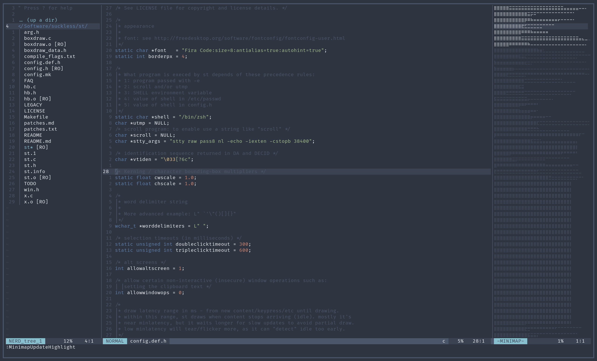

# st

This is my own patched build of the simple terminal.
There is a list of patches called 'patches.txt'.

This is the terminal I use for several hours on a daily basis.
It has scrollback, a nord theme, liguatures, boxdraw and a cursor that takes the color of the text it is on.

## Patches

Here are the patches I use:
* [anysize](https://st.suckless.org/patches/anysize/)
* [nordtheme](https://st.suckless.org/patches/nordtheme/)
		(modified a bit, i prefer orange to purple)
* [boxdraw](https://st.suckless.org/patches/boxdraw/)
* [ligatures](https://st.suckless.org/patches/ligatures/)
		(version that supports boxdraw)
* [bold](https://st.suckless.org/patches/bold-is-not-bright/)
* [newterm](https://st.suckless.org/patches/newterm/)
* [scrollback](https://st.suckless.org/patches/scrollback/)

## Screenshot

Here is a screenshot of it, running Neovim, Nerdtree and minimap.vim

## License
The MIT/X Consortium License
