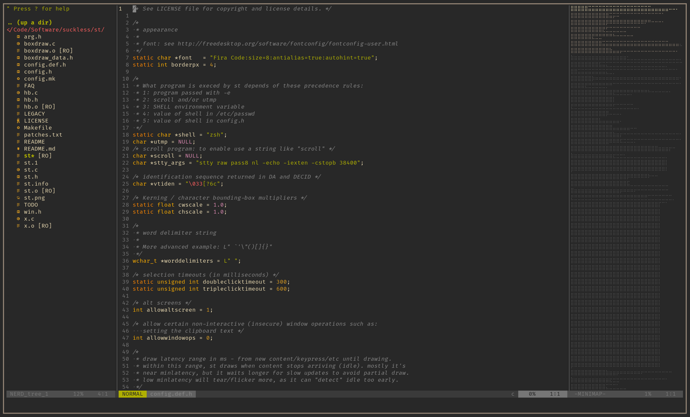

# st

This is my own patched build of the simple terminal.
There is a list of patches called 'patches.txt'.

This is the terminal I use for several hours on a daily basis.
It has scrollback, a gruvbox theme, liguatures, boxdraw, copyurl, support for w3m images and a cursor that takes the color of the text it is on.

## Patches

Here are the patches I use:
* [anysize](https://st.suckless.org/patches/anysize/)
* [boxdraw](https://st.suckless.org/patches/boxdraw/)
* [ligatures](https://st.suckless.org/patches/ligatures/)
		(version that supports boxdraw)
* [bold not bright](https://st.suckless.org/patches/bold-is-not-bright/)
* [undercurl](https://st.suckless.org/patches/undercurl/)
* [dynamic cursor](https://st.suckless.org/patches/dynamic-cursor-color/)

## Screenshot

Here is a screenshot of it, running tmux and Helix

## License

The [MIT/X Consortium License](https://mit-license.org/)
See LICENSE for copyright holders
