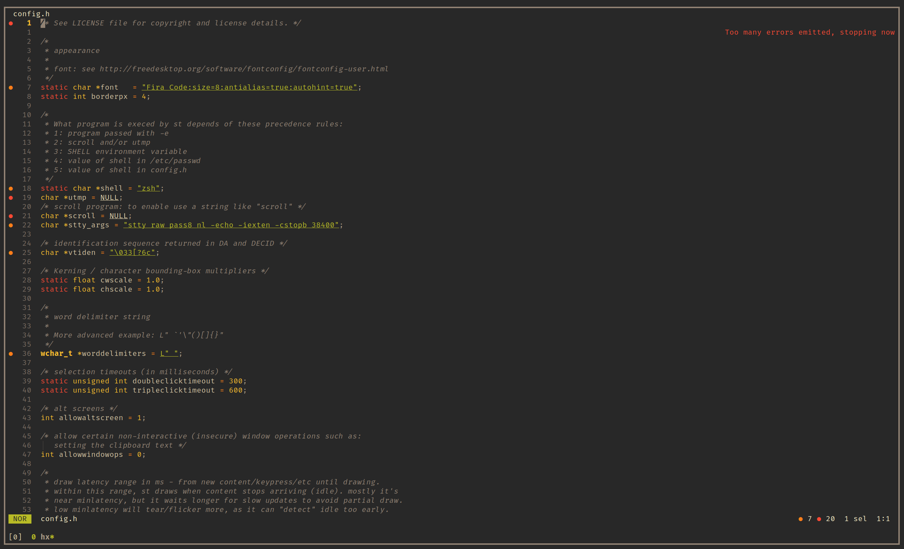

# st

This is my own patched build of the simple terminal.
There is a list of patches called 'patches.txt'.

This is the terminal I use for several hours on a daily basis.
It has scrollback, a gruvbox theme, liguatures, boxdraw, copyurl, support for w3m images and a cursor that takes the color of the text it is on.

## Patches

Here are the patches I use:
* [anysize](https://st.suckless.org/patches/anysize/)
* [gruvbox](https://st.suckless.org/patches/gruvbox/)
* [boxdraw](https://st.suckless.org/patches/boxdraw/)
* [ligatures](https://st.suckless.org/patches/ligatures/)
		(version that supports boxdraw)
* [bold not bright](https://st.suckless.org/patches/bold-is-not-bright/)
* [newterm](https://st.suckless.org/patches/newterm/)
* [scrollback](https://st.suckless.org/patches/scrollback/)
* [externalpipe](https://st.suckless.org/patches/externalpipe/)
* [copyurl](https://st.suckless.org/patches/copyurl/)
* [undercurl](https://st.suckless.org/patches/undercurl/)
* [w3m images](https://st.suckless.org/patches/w3m/)
* [dynamic cursor](https://st.suckless.org/patches/dynamic-cursor-color/)

I also use libxft-bgra instead of libxft.
libxft-bgra is in the [AUR](https://aur.archlinux.org/packages/libxft-bgra)

## Screenshot

Here is a screenshot of it, running Neovim, Nerdtree and minimap.vim

## License

The [MIT/X Consortium License](https://mit-license.org/)
